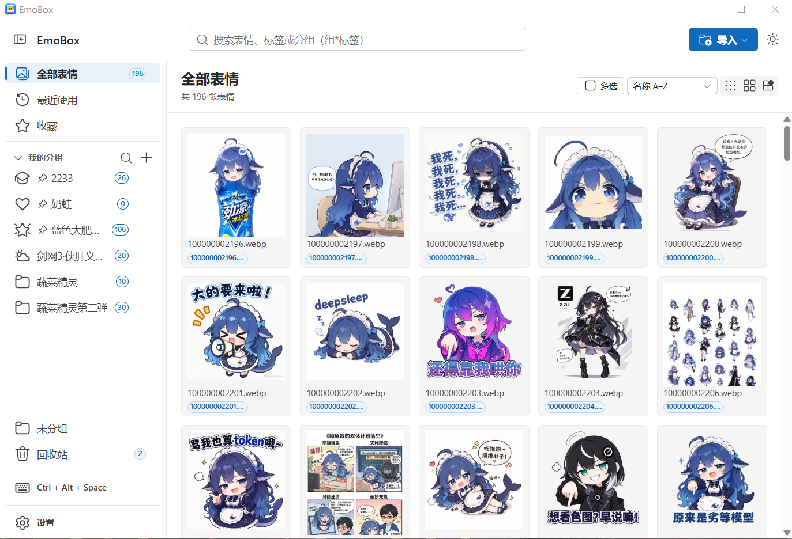
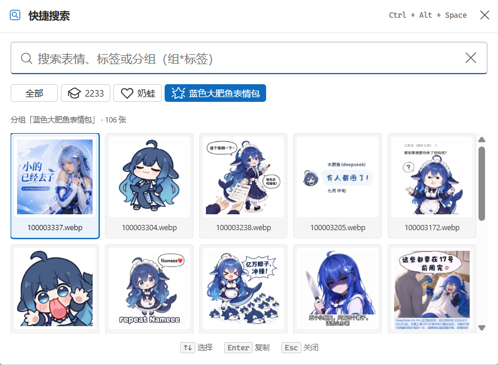

<div align="center">


# EmoBox

**Windows 优先的本地表情包管理器：导入整理、秒速搜索、一键复制到任何聊天窗口。**

[](LICENSE)
[](https://github.com/ldm0715/emobox/releases)
[](#-下载安装)

基于 Tauri v2 + React + TypeScript + Fluent UI 构建

</div>

<p align="center">
  
  <br/>
  <sub><b>主窗口</b> —— 导入、分组与标签整理</sub>
</p>
<p align="center">
  
  <br/>
  <sub><b>快速搜索浮层</b> —— <code>Ctrl+Alt+Space</code> 全局唤出</sub>
</p>


## ✨ 特性

- **受管导入，原文件永不动** —— 图片 / 文件夹导入与拖放都会复制进素材库并生成缩略图；导入文件夹时按子文件夹自动建立同名分组
- **秒速搜索** —— 全库跨字段即时搜索，支持 `组*标签` 精确语法；「最近使用」复制即记录、一键回找
- **全局搜索浮层** —— 在任何应用里按 `Ctrl+Alt+Space` 唤出独立搜索窗，选中即复制；可选自动粘贴回原窗口（微信 / QQ / 飞书等）
- **GIF 动图保真** —— 素材库悬停即播动画；复制到微信 / QQ 保留完整动画（按文件通道），不再只有首帧
- **智能去重** —— SHA-256 字节级 + dHash 感知双重去重，相似图可预览比对、可强制导入
- **完整整理体系** —— 分组 / 标签 / 收藏 / 回收站 / 多选批量操作 / 多种排序，全部本地持久化
- **OCR 识图打标签** —— 导入后自动识别图片中的文字并转为标签，用文字就能搜到表情；系统 OCR（本地离线）/ Tesseract（本地）/ AI Studio PaddleOCR（云端）三种引擎可选
- **应用内自动更新** —— 启动静默检查新版本，内置 GitHub 加速镜像源（可增删、测速排序），安装包经 SHA-256 校验后才安装
- **本地优先** —— 默认全离线，无账号、无使用数据上传，数据全部留在你自己的电脑上

## 📦 下载安装

前往 [**Releases**](https://github.com/ldm0715/emobox/releases/latest) 页面下载最新版本：

| 文件 | 说明 |
|---|---|
| `EmoBox_x.y.z_x64-setup.exe` | 安装版：NSIS 安装向导，缺少 WebView2 时会自动下载安装（推荐） |
| `EmoBox_x.y.z_x64.zip` | 便携版：解压即用，适合免安装场景 |

**系统要求**：Windows 10 / 11（x64）。

每个安装包的 SHA-256 校验和发布在 Release 说明末尾的「校验和」表格中，可用以下命令核对：

```powershell
certutil -hashfile EmoBox_x.y.z_x64-setup.exe SHA256
```

## 🚀 快速上手

1. **导入素材** —— 点工具栏「导入」，或直接把图片 / 文件夹拖进主窗口
2. **整理** —— 右键卡片或用批量条打标签、归分组、加收藏；双击卡片可预览大图
3. **随取随用** —— 主窗口单击卡片即复制；或在微信 / QQ 输入框里按 `Ctrl+Alt+Space` 唤出浮层，Enter 直接复制（可自动粘贴）

### 搜索语法

| 输入 | 含义 |
|---|---|
| `meme*猫` | 「meme」分组下带「猫」标签的表情 |
| `meme*` | 「meme」分组里的全部 |
| `*猫` | 全库带「猫」标签的 |
| `猫` | 跨分组名 / 文件名 / 标签名模糊搜索 |

全角 `＊` 同样支持，`:` / `：` 可替代 `*`。主窗口搜索框与快速搜索浮层使用同一套语法。

### 文字识别（OCR）

导入完成后，EmoBox 会在后台自动识别图片中的文字并追加为标签（文件名标签保留不变），之后直接搜文字就能找到表情。在 **设置 → 存储与导入 → 文字识别（OCR）** 中选择识别引擎：

| 引擎 | 说明 |
|---|---|
| 系统 OCR（本地） | 默认。完全本地离线、零成本，中文识别依赖系统的「文字识别」语言包 |
| Tesseract OCR（本地） | 开源本地引擎，需自行安装；建议安装时勾选中文语言包（chi_sim） |
| AI Studio PaddleOCR（云端·登录即用） | 百度云端识别，对表情包风格化文字更准；内嵌窗口登录百度账号即用，按张消耗每日免费额度 |
| AI Studio PaddleOCR（云端·手动配置） | 同上，需自行生成 Access Token 粘贴 |

本地引擎图片不出本机；云端引擎会把图片上传到百度服务器，请按需选择。右键表情打开标签弹窗，可对选中表情手动重跑识别；「存储与导入」页还提供「为现有表情补跑识别」，可批量回填存量表情。

### 全局快捷键

| 快捷键 | 功能 |
|---|---|
| `Ctrl+Alt+Space` | 唤出 / 隐藏快速搜索浮层 |
| `Ctrl+Alt+S` | 收藏当前剪贴板里的图片 |

两个快捷键均可在 **设置 → 快捷键** 中修改；被其他应用占用时，设置页会显示注册失败原因。

> **自动粘贴**：复制成功后，EmoBox 可自动把图片粘贴到唤出浮层前的窗口（微信 / QQ / 飞书等）。它只合成 `Ctrl+V`，**绝不发送 Enter**；目标窗口无法恢复时自动降级为仅复制。可在 **设置 → 常规** 中开关。

## 🗂 数据与隐私

- 所有数据只存在本机：素材副本、缩略图与数据库位于 `%APPDATA%\com.emobox.app`，卸载 EmoBox 不影响你的原始图片
- 导入 = 复制进素材库，EmoBox **绝不改动、移动或删除**你的原文件
- 无云端、无账号、无使用数据上传
- 仅有的联网行为：
  - 检查更新 / 下载安装包（GitHub Releases 或你配置的镜像源）
  - AI Studio 云端文字识别（默认关闭；切换到云端引擎后，识别时图片会上传到百度服务器）
  - 「联网下载网页 GIF」（默认关闭；开启后才会下载你刚复制的网页 GIF 地址）

## ⚠ 已知限制

- APNG / 动画 WebP 的缩略图与复制仅取静态首帧（GIF 完整支持）
- 从 Chrome / Edge 复制网页动图默认只保存首帧，可在设置中开启「联网下载网页 GIF」保存完整动图
- 个别应用写入剪贴板的私有图片格式可能只被识别为静态图

## 🛠 从源码构建

**环境要求**：Windows 10 / 11 · Node.js 22+ · Rust stable（`x86_64-pc-windows-msvc`）+ MSVC C++ Build Tools · WebView2 Runtime（Win11 / 多数 Win10 已内置）

```powershell
npm install
npm run tauri dev                   # 开发模式（Vite + Tauri）
npm run tauri build -- --no-bundle  # 构建单文件 exe（src-tauri/target/release/emobox.exe）
```

改动代码后请跑一遍检查与测试：

```powershell
npm run build                                       # tsc --noEmit + vite build
npx vitest run                                      # 前端单测
cargo fmt --check --manifest-path src-tauri/Cargo.toml
cargo check --manifest-path src-tauri/Cargo.toml
cargo clippy --manifest-path src-tauri/Cargo.toml -- -D warnings
cargo test  --manifest-path src-tauri/Cargo.toml
```

> 构建时 Fluent UI 体积会触发 Vite 的 500 kB chunk 警告，属预期行为，不影响构建产物。

## 🤝 参与贡献

欢迎提交 Issue 与 PR！

- Bug 反馈请使用 [Bug 模板](.github/ISSUE_TEMPLATE/bug_report.yml)，附上复现步骤与 EmoBox 版本
- 功能建议先用 [功能建议模板](.github/ISSUE_TEMPLATE/feature_request.yml) 讨论
- 提交前请阅读 [CONTRIBUTING.md](CONTRIBUTING.md)：开发环境、验收标准、提交与发布规范

## 📄 许可证与依赖

EmoBox 以 [GPL-3.0](LICENSE) 协议开源，© EmoBox contributors。

本项目基于以下开源项目构建，感谢这些社区：

| 项目 | 说明 |
|---|---|
| [Tauri](https://github.com/tauri-apps/tauri) | 跨平台桌面应用框架（Rust 后端 + 系统 WebView） |
| [Rust](https://github.com/rust-lang/rust) | 后端语言与核心库生态（rusqlite、tokio、ureq、image 等） |
| [React](https://github.com/facebook/react) | 前端 UI 框架 |
| [Fluent UI](https://github.com/microsoft/fluentui) | Microsoft Fluent 2 设计系统的 React 组件库 |
| [Vite](https://github.com/vitejs/vite) | 前端构建工具 |
| [TypeScript](https://github.com/microsoft/TypeScript) | 前端语言 |

完整依赖清单见 [package.json](package.json)（前端）与 [src-tauri/Cargo.toml](src-tauri/Cargo.toml)（Rust）。
